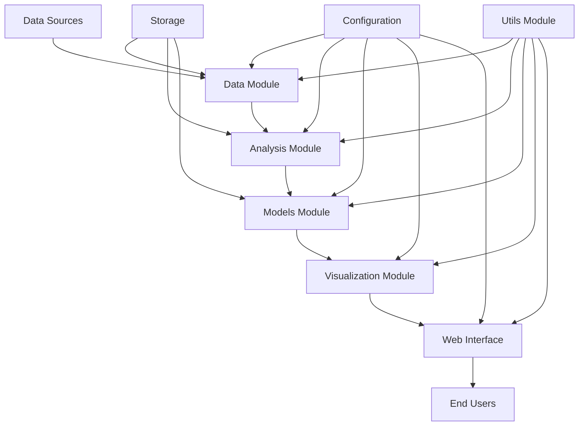

# StockTracker Architecture Documentation

## 1. System Architecture Overview

### High-level Architecture

StockTracker is a comprehensive stock analysis and prediction system built with a modular architecture that separates concerns into distinct components. The system follows a layered architecture pattern with data ingestion, processing, analysis, and presentation layers.



### Core Components

1. **Data Module** (`data/`)
   - Responsible for fetching and preprocessing stock market data
   - Interfaces with external data sources through akshare library
   - Provides clean, standardized data for downstream modules

2. **Analysis Module** (`analysis/`)
   - Performs technical analysis, risk assessment, and portfolio analysis
   - Calculates various financial indicators and metrics
   - Implements backtesting framework for trading strategies

3. **Models Module** (`models/`)
   - Contains machine learning models for stock price prediction
   - Implements both traditional models (Random Forest, XGBoost) and deep learning models (LSTM, GRU, Transformer)
   - Provides model training, evaluation, and prediction capabilities

4. **Visualization Module** (`visualization/`)
   - Creates interactive charts and dashboards for data visualization
   - Implements various chart types including candlestick, technical indicators, and 3D visualizations
   - Integrates with Plotly for rich interactive visualizations

5. **Web Interface Module** (`ui/`)
   - Provides a user-friendly web interface using Streamlit
   - Organizes functionality into intuitive pages and workflows
   - Enables interactive exploration of stock data and analysis results

6. **Utils Module** (`utils/`)
   - Contains shared utility functions used across the system
   - Provides common functionality for data processing, file handling, and system operations

7. **Configuration Module** (`configs/`)
   - Manages system configuration and settings
   - Provides centralized configuration management for all modules

### Technology Stack

- **Programming Language**: Python 3.x
- **Machine Learning Frameworks**: TensorFlow/Keras, scikit-learn, XGBoost
- **Data Processing**: pandas, NumPy
- **Visualization**: Plotly, matplotlib
- **Web Framework**: Streamlit
- **Data Sources**: akshare (Chinese stock market data)
- **Package Management**: uv/requirements.txt/pyproject.toml
- **Testing**: unittest
- **Documentation**: Markdown

### Data Flow Overview

1. **Data Ingestion**: External stock market data is fetched through the data module
2. **Data Processing**: Raw data is cleaned, validated, and transformed
3. **Analysis**: Processed data is analyzed using various financial models and techniques
4. **Modeling**: Machine learning models are trained and used for predictions
5. **Visualization**: Results are visualized using interactive charts and dashboards
6. **Presentation**: Visualizations and analysis results are presented through the web interface

## 2. Module Architecture

### Analysis Module Structure (`analysis/`)

The analysis module provides comprehensive financial analysis capabilities:

```
analysis/
├── __init__.py
├── backtest.py         # Strategy backtesting framework
├── portfolio.py        # Portfolio analysis and optimization
├── risk.py             # Risk assessment and metrics calculation
└── technical.py        # Technical indicators calculation
```

- **backtest.py**: Implements a complete backtesting engine with support for various trading strategies, transaction costs simulation, and performance evaluation metrics
- **portfolio.py**: Provides portfolio construction, optimization algorithms (mean-variance, minimum variance, risk parity), and performance attribution analysis
- **risk.py**: Calculates key risk metrics including volatility, Value at Risk (VaR), maximum drawdown, Sharpe ratio, beta, alpha, and performs Monte Carlo simulations
- **technical.py**: Implements calculation of common technical indicators such as moving averages, RSI, MACD, Bollinger Bands, and stochastic oscillators

### Data Module Structure (`data/`)

The data module handles all data-related operations:

```
data/
├── __init__.py
└── fetcher.py          # Data fetching and preprocessing
```

- **fetcher.py**: Interfaces with akshare to fetch stock market data, handles data validation and preprocessing, and provides a clean API for other modules

### Models Module Structure (`models/`)

The models module contains all machine learning implementations:

```
models/
├── __init__.py
├── advanced.py         # Advanced ML models (LSTM, GRU, Transformer)
├── base.py             # Base model implementations
└── predictors.py       # High-level prediction APIs
```

- **advanced.py**: Implements advanced machine learning models including deep learning architectures (LSTM, GRU, Transformer) and ensemble methods (Random Forest, XGBoost)
- **base.py**: Provides base model classes and common functionality
- **predictors.py**: Offers high-level APIs for stock price prediction, risk assessment, and portfolio analysis

### UI Module Structure (`ui/`)

The UI module provides the web interface:

```
ui/
├── __init__.py
└── web.py              # Streamlit web application
```

- **web.py**: Implements the complete Streamlit web application with multiple pages for different functionalities

### Visualization Module Structure (`visualization/`)

The visualization module handles all charting and visualization needs:

```
visualization/
├── __init__.py
└── charts.py           # Charting and visualization functions
```

- **charts.py**: Provides a comprehensive set of visualization functions for creating interactive charts, dashboards, and specialized financial visualizations

### Utils Module Structure (`utils/`)

The utils module contains shared utility functions:

```
utils/
└── __init__.py
```

- Contains helper functions used across different modules

## 3. Data Flow

### Data Ingestion Process

1. **External Data Sources**: StockTracker primarily uses akshare to fetch Chinese stock market data
2. **Data Fetching**: The `data.fetcher` module handles API calls and data retrieval
3. **Data Validation**: Retrieved data is validated for completeness and correctness
4. **Data Preprocessing**: Data is cleaned, formatted, and standardized for internal use

### Processing Pipeline

1. **Raw Data Ingestion**: Data is fetched from external sources
2. **Quality Assurance**: Data validation and cleaning processes ensure data integrity
3. **Feature Engineering**: Technical indicators and other features are calculated
4. **Data Transformation**: Data is transformed into appropriate formats for analysis and modeling

### Storage

StockTracker primarily operates with in-memory data processing. For persistence:
- Model artifacts are saved to disk using joblib and TensorFlow's model saving capabilities
- Configuration files are stored as JSON/YAML
- Temporary data may be cached in local files

### Data Export Capabilities

1. **Chart Exports**: Visualizations can be exported as PNG, JPEG, PDF, SVG
2. **Data Exports**: Raw and processed data can be exported as CSV
3. **Report Exports**: Analysis results can be exported as JSON or text reports

## 4. Model Architecture

### ML Model Structure

StockTracker implements a variety of machine learning models organized in the models module:

```
models/
├── base.py             # Base model classes
├── advanced.py         # Advanced model implementations
│   ├── LSTM Model
│   ├── GRU Model
│   ├── Transformer Model
│   ├── Random Forest Model
│   └── XGBoost Model
└── predictors.py       # High-level prediction APIs
```

### Training Pipeline

1. **Data Preparation**: Historical stock data is prepared for training
2. **Feature Engineering**: Technical indicators and other features are calculated
3. **Model Training**: Models are trained using appropriate algorithms
4. **Model Evaluation**: Performance is evaluated using metrics like MAE, RMSE, MAPE
5. **Model Persistence**: Trained models are saved for future use

### Prediction Pipeline

1. **Data Loading**: Latest stock data is loaded
2. **Preprocessing**: Data is preprocessed and features are engineered
3. **Model Loading**: Trained model is loaded from storage
4. **Prediction**: Model makes predictions for future stock prices
5. **Post-processing**: Results are formatted and confidence intervals are calculated

### Model Persistence

1. **Neural Networks**: Saved using TensorFlow's HDF5 format
2. **Traditional ML Models**: Saved using joblib
3. **Model Metadata**: Stored as JSON files with model information
4. **Versioning**: Models are versioned with timestamps for tracking

## 5. Web Interface Architecture

### Streamlit Structure

The web interface is built using Streamlit, organized as follows:

```
ui/
└── web.py              # Main Streamlit application
    ├── Page routing
    ├── Session state management
    ├── Component rendering
    └── API integration
```

### Page Organization

1. **Home Page**: Overview and quick start functionality
2. **Stock Analysis**: Detailed stock data analysis
3. **Technical Indicators**: Technical analysis tools
4. **Price Prediction**: Machine learning-based price predictions
5. **Risk Assessment**: Comprehensive risk evaluation
6. **Portfolio Analysis**: Investment portfolio tools
7. **Backtest Analysis**: Trading strategy backtesting
8. **Settings**: User preferences and configurations
9. **Help Documentation**: User guide and documentation

### State Management

1. **Session State**: Uses Streamlit's session state to maintain user data across interactions
2. **Data Caching**: Implements caching mechanisms to avoid redundant data fetching
3. **User Preferences**: Stores user settings in session state for personalized experience

### API Integration

1. **Internal Modules**: Direct integration with StockTracker's analysis, model, and visualization modules
2. **Real-time Data**: Fetches live data through the data module
3. **Asynchronous Operations**: Uses Streamlit's async capabilities for long-running operations

## 6. Visualization Architecture

### Charting Components

The visualization module provides:

1. **Interactive Charts**: Built with Plotly for rich user interactions
2. **Technical Analysis Charts**: Specialized charts for financial data visualization
3. **Dashboard Components**: Composite visualizations for comprehensive views
4. **Export Functions**: Capabilities to save charts in various formats

### Real-time Visualization

1. **Live Data Updates**: Supports streaming data visualization
2. **Dynamic Charting**: Charts update in real-time as new data arrives
3. **Performance Optimization**: Efficient rendering for smooth user experience

### Export Capabilities

1. **Image Exports**: Charts can be exported as PNG, JPEG, PDF, SVG
2. **Data Exports**: Underlying data can be exported as CSV
3. **Report Generation**: Automated report creation with visualizations

### Custom Visualization Framework

1. **Modular Design**: Reusable visualization components
2. **Template System**: Standardized chart templates for consistency
3. **Extensibility**: Easy to add new chart types and visualizations

## 7. Deployment Architecture

### Local Deployment

1. **Development Environment**: 
   - Python 3.x with required dependencies
   - Package management through uv or pip
   - Local data storage

2. **Installation Process**:
   - Clone repository
   - Install dependencies using uv or pip
   - Run application using Streamlit

3. **Runtime Requirements**:
   - Internet connection for data fetching
   - Sufficient memory for data processing
   - Storage for model artifacts

### Server Deployment

1. **Containerization**: Docker support for consistent deployment
2. **Cloud Deployment**: Ready for deployment on cloud platforms (AWS, Azure, GCP)
3. **Scalability**: Horizontal scaling capabilities for handling multiple users
4. **Load Balancing**: Support for load distribution across multiple instances

### Scalability Considerations

1. **Horizontal Scaling**: Web interface can be scaled horizontally
2. **Database Integration**: Ready for integration with persistent databases
3. **Caching Layer**: Implementation of caching for improved performance
4. **Asynchronous Processing**: Background tasks for long-running operations

### Load Distribution

1. **Web Tier**: Streamlit application can be load balanced
2. **Processing Tier**: Analysis and modeling tasks can be distributed
3. **Data Tier**: Data fetching can be parallelized
4. **Storage Tier**: Model artifacts and cached data can be stored in shared storage

---