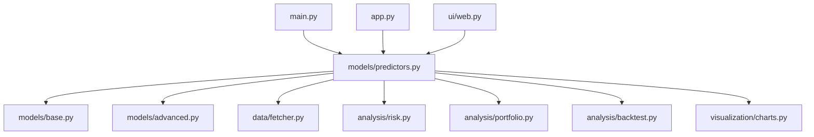

# StockTracker Developer Documentation

This document provides guidelines and instructions for developers who want to extend and contribute to the StockTracker project. It covers the project structure, coding standards, and procedures for adding new features.

## Table of Contents

1. [Project Structure Overview](#project-structure-overview)
2. [Code Style Guide](#code-style-guide)
3. [Adding New Models](#adding-new-models)
4. [Adding New Visualizations](#adding-new-visualizations)
5. [Adding Technical Indicators](#adding-technical-indicators)
6. [Testing Guidelines](#testing-guidelines)
7. [Contributing Workflow](#contributing-workflow)

## Project Structure Overview

StockTracker follows a modular architecture with clearly separated components:

```
StockTracker/
├── analysis/           # Financial analysis modules
│   ├── backtest.py     # Strategy backtesting
│   ├── portfolio.py    # Portfolio analysis and optimization
│   ├── risk.py         # Risk assessment
│   └── technical.py    # Technical indicators
├── data/               # Data handling
│   └── fetcher.py      # Data fetching from akshare
├── docs/               # Documentation files
├── examples/           # Example scripts
├── models/             # Prediction models
│   ├── base.py         # Base LSTM model
│   ├── advanced.py     # Advanced models (GRU, Transformer, RF, XGBoost)
│   └── predictors.py   # High-level prediction API
├── tests/              # Test suite
├── ui/                 # User interface
│   └── web.py          # Streamlit web interface
├── utils/              # Utility functions
├── visualization/      # Data visualization
│   └── charts.py       # Charting functions
├── app.py              # Streamlit web app entry point
├── main.py             # CLI entry point
└── requirements.txt    # Project dependencies
```

### Module Relationships



### Data Flow Through the System

1. **Data Acquisition**: `data/fetcher.py` retrieves stock data from akshare
2. **Processing**: Data is processed and prepared for analysis or modeling
3. **Analysis**: `analysis/` modules perform financial calculations
4. **Modeling**: `models/` modules train and use prediction models
5. **Visualization**: `visualization/` modules create charts and dashboards
6. **Presentation**: Results are displayed via CLI (`main.py`) or Web UI (`app.py`)

## Code Style Guide

### Python Coding Standards

StockTracker follows PEP 8 style guidelines with some additional conventions:

- Use 4 spaces for indentation (no tabs)
- Limit lines to 88 characters (to match Black's default)
- Use descriptive variable and function names
- Write docstrings for all public functions, classes, and modules
- Follow naming conventions:
  - `snake_case` for functions and variables
  - `PascalCase` for classes
  - `UPPER_CASE` for constants

### Naming Conventions

- Functions and variables: `snake_case`
- Classes: `PascalCase`
- Constants: `UPPER_CASE`
- Private members: prefixed with `_`
- Modules: `snake_case.py`

### Documentation Standards

All public functions, classes, and modules must include docstrings using the Google style:

```python
def calculate_moving_average(data: pd.Series, window: int) -> pd.Series:
    """Calculate the moving average of a data series.
    
    Args:
        data: The time series data to calculate the moving average for.
        window: The number of periods to include in the moving average.
        
    Returns:
        A pandas Series containing the moving average values.
        
    Raises:
        ValueError: If window is not a positive integer.
    """
    if not isinstance(window, int) or window <= 0:
        raise ValueError("Window must be a positive integer")
    
    return data.rolling(window=window).mean()
```

### Type Hinting Requirements

All functions must include type hints for parameters and return values:

```python
from typing import Dict, List, Optional, Union
import pandas as pd
import numpy as np

def example_function(
    data: pd.DataFrame, 
    period: int = 20, 
    column: str = 'close'
) -> pd.Series:
    """Example function with proper type hints."""
    return data[column].rolling(window=period).mean()
```

## Adding New Models

### How to Implement a New Prediction Model

1. **Choose the Implementation Location**:
   - For simple models: Extend `models/base.py`
   - For advanced models: Extend `models/advanced.py`

2. **Create a New Model Class**:
   ```python
   class NewPredictionModel:
       def __init__(self, look_back: int = 60):
           """Initialize the model with required parameters."""
           self.look_back = look_back
           self.model = None
       
       def train(self, data: pd.DataFrame) -> Any:
           """Train the model with historical data.
           
           Args:
               data: Historical stock data with at least 'close' column
               
           Returns:
               Training history or metrics
           """
           # Implementation here
           pass
       
       def predict(self, data: pd.DataFrame) -> float:
           """Make a prediction based on the latest data.
           
           Args:
               data: Historical stock data
               
           Returns:
               Predicted price
           """
           # Implementation here
           pass
   ```

3. **Integration with the Predictors Module**:
   - Add your model type to the `model_type` parameter options in `models/predictors.py`
   - Update the `predict_stock_price` function to handle your new model type
   - Modify the model creation logic to instantiate your new model class

4. **Required Interfaces/Methods**:
   - `__init__()`: Initialize model parameters
   - `train(data)`: Train the model with historical data
   - `predict(data)`: Generate predictions from trained model
   - Optional: `save_model()`, `load_model()` for persistence

### Testing New Models

1. Add unit tests in the `tests/` directory
2. Create a test script that verifies:
   - Model training completes without errors
   - Predictions are generated correctly
   - Results are reasonable (e.g., not NaN or infinite)
3. Add your model to the comprehensive test suite in `tests/test_all.py`

Example test structure:
```python
def test_new_model():
    """Test the new prediction model."""
    # Get test data
    stock_data = data_fetcher.get_stock_data('000001', period='daily', 
                                            start_date='20240101', adjust='qfq')
    
    # Create model instance
    model = NewPredictionModel(look_back=60)
    
    # Test training
    history = model.train(stock_data)
    assert history is not None
    
    # Test prediction
    prediction = model.predict(stock_data)
    assert isinstance(prediction, (int, float))
    assert not np.isnan(prediction)
```

## Adding New Visualizations

### Extending the Visualization Module

New visualizations should be added to `visualization/charts.py` in the `StockVisualizer` class:

```python
class StockVisualizer:
    def plot_new_chart_type(self, data: pd.DataFrame, **kwargs) -> go.Figure:
        """Create a new chart type.
        
        Args:
            data: Stock data for visualization
            **kwargs: Additional parameters for customization
            
        Returns:
            Plotly figure object
        """
        # Implementation here
        fig = go.Figure()
        # Add traces, customize layout
        return fig
```

### Creating New Chart Types

1. **Determine Chart Requirements**:
   - What data is needed?
   - What insights should it provide?
   - What customization options are needed?

2. **Implement the Visualization Function**:
   ```python
   def plot_custom_indicator(self, data: pd.DataFrame, indicator_data: pd.Series, 
                            title: str = "Custom Indicator") -> go.Figure:
       """Plot a custom technical indicator.
       
       Args:
           data: Stock price data
           indicator_data: Custom indicator values
           title: Chart title
           
       Returns:
           Plotly figure object
       """
       fig = go.Figure()
       
       # Add price data
       fig.add_trace(go.Scatter(
           x=data.index,
           y=data['close'],
           mode='lines',
           name='Price'
       ))
       
       # Add indicator data
       fig.add_trace(go.Scatter(
           x=indicator_data.index,
           y=indicator_data,
           mode='lines',
           name='Custom Indicator'
       ))
       
       fig.update_layout(
           title=title,
           xaxis_title="Date",
           yaxis_title="Value"
       )
       
       return fig
   ```

3. **Integration with Existing UI**:
   - Add the new visualization function to the `StockVisualizer` class
   - Update `models/predictors.py` to expose the new chart type
   - Add the visualization to the Streamlit web interface in `ui/web.py`

### Performance Considerations

1. **Data Sampling**: For large datasets, consider sampling to improve performance:
   ```python
   # Sample data for better performance
   if len(data) > 1000:
       data = data.iloc[::len(data)//1000]  # Sample to ~1000 points
   ```

2. **Efficient Traces**: Use appropriate trace types for better performance:
   - `go.Scatter` for line charts
   - `go.Bar` for bar charts
   - `go.Candlestick` for candlestick charts

3. **Memory Management**: Clear figures after use when creating many charts:
   ```python
   fig = visualizer.plot_chart(data)
   # Display or save the figure
   fig.show()
   # Clear to free memory
   fig = None
   ```

## Adding Technical Indicators

### How to Implement New Indicators

New technical indicators should be implemented in `analysis/technical.py`:

```python
def new_technical_indicator(
    data: pd.DataFrame, 
    period: int = 14, 
    column: str = 'close'
) -> pd.Series:
    """Calculate a new technical indicator.
    
    Args:
        data: Stock data DataFrame
        period: Calculation period
        column: Data column to use for calculation
        
    Returns:
        pandas Series with indicator values
        
    Raises:
        ValueError: If input data is invalid
    """
    # Validate inputs
    if not isinstance(data, pd.DataFrame):
        raise ValueError("Data must be a pandas DataFrame")
    
    if column not in data.columns:
        raise ValueError(f"Column '{column}' not found in data")
    
    # Calculate indicator
    indicator_values = # Implementation here
    
    return pd.Series(indicator_values, index=data.index)
```

### Integration with analysis/technical.py

1. **Add Input Validation**: All indicators should validate their inputs
2. **Consistent Return Types**: Return `pd.Series` with proper indexing
3. **Error Handling**: Raise appropriate exceptions for invalid inputs
4. **Documentation**: Include comprehensive docstrings

### Validation Requirements

1. **Input Data Validation**:
   ```python
   if not isinstance(data, pd.DataFrame):
       raise ValueError("Data must be a pandas DataFrame")
   
   required_columns = ['high', 'low', 'close']
   for col in required_columns:
       if col not in data.columns:
           raise ValueError(f"Required column '{col}' missing from data")
   ```

2. **Parameter Validation**:
   ```python
   if period <= 0:
       raise ValueError("Period must be positive")
   
   if period > len(data):
       raise ValueError("Period cannot be larger than data length")
   ```

3. **Output Validation**:
   - Return values should match the index of input data
   - Handle edge cases (e.g., insufficient data)
   - Return `pd.Series` or `pd.DataFrame` as appropriate

### Documentation Standards

Each indicator should include:
1. **Clear Description**: Explain what the indicator measures
2. **Parameters**: Document all input parameters
3. **Returns**: Specify the output format
4. **Exceptions**: List possible exceptions
5. **Example Usage**: Show how to use the indicator

Example:
```python
def relative_strength_index(data: pd.DataFrame, period: int = 14, 
                          column: str = 'close') -> pd.Series:
    """Calculate the Relative Strength Index (RSI).
    
    The RSI is a momentum oscillator that measures the speed and change 
    of price movements. It ranges from 0 to 100, with values above 70 
    indicating overbought conditions and values below 30 indicating 
    oversold conditions.
    
    Args:
        data: Stock data DataFrame with at least the specified column
        period: Number of periods to calculate RSI, default is 14
        column: Column name to calculate RSI for, default is 'close'
        
    Returns:
        pandas Series with RSI values ranging from 0 to 100
        
    Raises:
        ValueError: If data is not a DataFrame, column is missing, 
                   or period is invalid
                   
    Example:
        >>> stock_data = data_fetcher.get_stock_data('000001')
        >>> rsi = relative_strength_index(stock_data, period=14)
        >>> print(rsi.tail())
    """
    # Implementation here
```

## Testing Guidelines

### Unit Testing Approach

StockTracker uses a comprehensive testing approach with multiple test files:

1. **Module-specific tests**: Individual test files for major components
2. **Integration tests**: `test_all.py` for end-to-end testing
3. **Regression tests**: `test_fixes.py` for verifying bug fixes

### Test File Organization

```
tests/
├── test_all.py          # Comprehensive test suite
├── test_fixes.py        # Regression tests for bug fixes
├── test_portfolio.py    # Portfolio analysis tests
└── test_transformer.py  # Transformer model tests
```

### Writing New Tests

1. **Create Test Functions**:
   ```python
   def test_new_feature():
       """Test the new feature."""
       # Setup test data
       # Execute function
       # Assert expected results
       assert result == expected
   ```

2. **Use the Test Suite Structure**:
   ```python
   def test_new_indicator():
       """Test new technical indicator."""
       print("\n=== Testing New Indicator ===")
       
       try:
           # Get test data
           stock_data = data_fetcher.get_stock_data(
               '000001', 
               period='daily', 
               start_date='20240101', 
               adjust='qfq'
           )
           
           # Test indicator
           result = new_indicator_function(stock_data, period=14)
           
           # Validate result
           assert isinstance(result, pd.Series)
           assert len(result) > 0
           assert not result.isna().all()
           
           print("✓ New indicator test passed")
           return True
           
       except Exception as e:
           print(f"✗ New indicator test failed: {e}")
           return False
   ```

3. **Add to Comprehensive Test Suite**:
   - Add your test to the appropriate section in `tests/test_all.py`
   - Follow the existing pattern for logging results

### Running Test Suites

1. **Run All Tests**:
   ```bash
   python tests/test_all.py
   ```

2. **Run Specific Test Files**:
   ```bash
   python tests/test_portfolio.py
   python tests/test_transformer.py
   ```

3. **Run with pytest** (if installed):
   ```bash
   pytest tests/
   ```

## Contributing Workflow

### Git Branching Strategy

StockTracker follows a simplified GitFlow workflow:

1. **Main Branch**: `main` - Production-ready code
2. **Development Branch**: `develop` - Integration branch for features
3. **Feature Branches**: `feature/feature-name` - For new features
4. **Bugfix Branches**: `bugfix/issue-description` - For bug fixes
5. **Release Branches**: `release/version` - For preparing releases

### Branch Naming Convention

- Features: `feature/descriptive-name`
- Bug fixes: `bugfix/descriptive-name`
- Documentation: `docs/descriptive-name`
- Releases: `release/version-number`

### Pull Request Process

1. **Fork the Repository**: Create your own fork of StockTracker
2. **Create a Feature Branch**: 
   ```bash
   git checkout -b feature/your-feature-name
   ```
3. **Implement Your Changes**: Follow the coding standards
4. **Add Tests**: Ensure your changes are properly tested
5. **Update Documentation**: Modify relevant documentation files
6. **Commit Your Changes**: Use clear, descriptive commit messages
7. **Push to Your Fork**: 
   ```bash
   git push origin feature/your-feature-name
   ```
8. **Open a Pull Request**: Submit PR to the `develop` branch

### Code Review Guidelines

1. **Review Checklist**:
   - [ ] Code follows style guidelines
   - [ ] Adequate documentation provided
   - [ ] Tests included and passing
   - [ ] No breaking changes (unless intentional)
   - [ ] Performance considerations addressed

2. **Review Process**:
   - At least one maintainer must approve the PR
   - All CI checks must pass
   - Address all review comments before merging
   - Squash and merge for clean history

### Release Process

1. **Prepare Release Branch**:
   ```bash
   git checkout -b release/v1.2.0 develop
   ```

2. **Update Version Information**:
   - Update version in `pyproject.toml`
   - Update `CHANGELOG.md`
   - Finalize documentation

3. **Create Release Candidate**:
   - Tag the release candidate
   - Perform final testing

4. **Merge to Main**:
   ```bash
   git checkout main
   git merge release/v1.2.0
   git tag -a v1.2.0 -m "Release version 1.2.0"
   git push origin main --tags
   ```

5. **Update Develop Branch**:
   ```bash
   git checkout develop
   git merge main
   git push origin develop
   ```

---

*This documentation is maintained by the StockTracker development team. For questions or suggestions, please open an issue on GitHub.*